# BPMN Tasks

## 1. Dispatch of goods

### Задание: 

Компания, производящая компьютерное оборудование, хотела бы смоделировать процесс доставки, чтобы сделать его видимым и
понятным для всех сотрудников фирмы. 

Вот описание процесса, данное офис-менеджером:
При отправке заказов я сначала определяю физический размер заказа. Если я определяю, что размер посылки больше, чем у обычной почтовой коробки (она же "специальная доставка"), я связываюсь с тремя транспортными компаниями и запрашиваю у каждой из них цену. Затем я выбираю лучшее предложение и сообщаю продавцу о предстоящей
отправке.
С другой стороны, если я решаю, что для заказа можно использовать обычную упаковочную коробку, я распечатываю этикетку и проверяю, нужна ли страховка. Если страховка необходима, сотрудники отдела логистики позаботятся
о страховании отправления.

Пока это происходит, сотрудники склада собирают и упаковывают необходимые товары.
Как только способ отгрузки определен и настроен, сотрудники склада подготавливают
товары для отправки выбранному поставщику.

**Подсказки**:
- Задача процесса заключается только в подготовке к отправке, а не в самой отправке.
- Этот процесс должен быть для внутренней организации. Транспортные компании в нем не участвуют

**BPMN-схема**:

## 2. Eliminate the OR join

### Задание:

Удалить неисключающий шлюз

**Исходная BPMN-схема**:

**Исправленная BPMN-схема**:

## 3. Recourse

### Задание: 

Держатели страховых полисов могут быть вынуждены вернуть деньги, которые они получили от страховой компании по разным причинам. 

Эта процедура называется "обращение в суд", юрист страховой компании описывает, как работает этот процесс:

Я получил сообщение о возможном обращении в суд. Я изучу это и, если решу, что обращение
в суд невозможно, просто закрою дело. 
Если я решу, что обращение в суд действительно возможно, я отправлю запрос на возврат средств, а затем назначу дату платежа.

Далее произойдет одно из трех событий. 
* Если мы получим деньги, я обработаю платеж и закрою дело. 
* Если по истечении срока платеж не будет получен, я передам дело в коллекторское агентство. 
* Если я получу ответ от страхователя, обжалующего выплату, я изучу причину обжалования. Если я приду к выводу, что страхователь был прав, я закрою дело. В противном случае я передам дело в коллекторское агентство.

**BPMN-схема**:

## 4. Unfortunate modeling style

### Задание 1:

Проверьте приведенную ниже модель процесса и попытайтесь привести ее в соответствие с лучшими практиками моделирования, которые мы определили во время тренинга.

**Исходная BPMN-схема**:
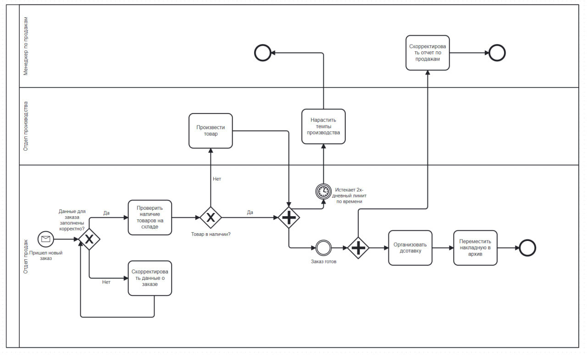

**Исправленная BPMN-схема**:
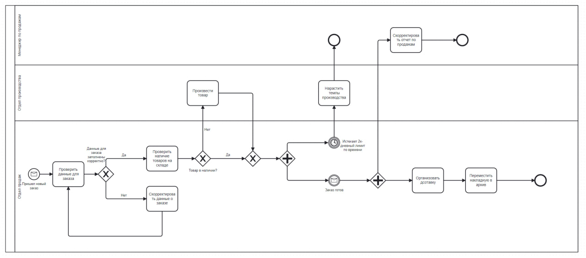

### Задание 2:

Семантически скорректируйте данную модель процесса. 

Убедитесь, что она соответствует следующему описанию от генерального директора: 

"Когда мы получаем заказ, отдел продаж сначала проверяет полноту данных. Если нет, они просят клиента отправить недостающую информацию и подождать ее получения. Если данные для заказа заполнены, процесс может быть продолжен, и отдел продаж проверит наличие товаров. Если у нас все есть в наличии, менеджер по продажам может начать корректировать отчеты, в то время как другие отделы продаж сотрудники обрабатывают отправку и архивируют накладную. Если заказанного товара нет на складе, производственный отдел изготовит его до того, как мы приступим к процессу. Если производство занимает более 2 дней, они информируют клиента о задержке."

**BPMN-схема**:
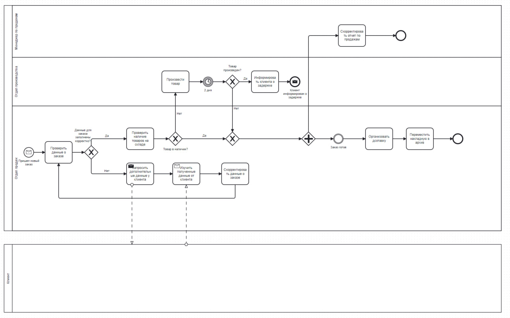

## 5. Credit scoring

### Задание:

Банковский служащий использует веб-сайт банка для определения кредитоспособности клиента. Этот веб-сайт взаимодействует с внутренней системой оценки кредитоспособности банка, которая, в свою очередь, взаимодействует со сторонним агентством по защите кредитов для предоставления кредитных оценок клиента.

Сразу после запуска процесса сервер отправляет запрос на оценку.

Сначала агентство выполняет быструю оценку (уровень 1). Это часто приводит к немедленному результату, который затем возвращается непосредственно в банковскую серверную систему в течение нескольких секунд. Банковский процесс отображает результат клерку, работающему на веб-сайте банка.

Иногда результат не может быть определен сразу и требуется больше времени. В этом случае
стороннее агентство информирует банковский процесс о задержке, а затем начинает подсчет баллов второго уровня (который может занять до нескольких минут). После определения результата подсчета информация отправляется
обратно в банковский процесс. Банковский процесс отправляет на веб-сайт банка сообщение, информирующее клерка о задержке, и просит его повторить проверку позже. Как только придет результат, его можно будет просмотреть в интерфейсе.

**Подсказки**:
- Интерфейс (банк): свернутый пул (не моделировать детали)
- Скоринг (сервер банка): расширенный пул (моделировать все детали)
- Скоринг (Агентство по защите кредитов): расширенный пул (моделировать все детали)

**BPMN-схема**:
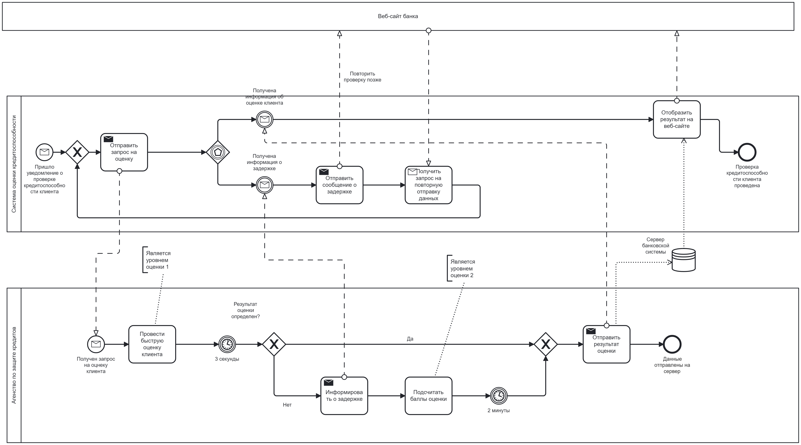

## 6. Self-service restaurant

### Задание:

Сделайте модель следующего оптимизированного процесса:

Гость приходит в ресторан, когда проголодался. Гость выбирает блюдо из постоянно меняющегося меню и ждет, пока настанет его очередь. Затем гость делает заказ сотруднику. 
Сотрудник вводит заказ в систему POS-кассы и забирает деньги у гостя. После оплаты сотрудник настраивает звуковой сигнал и передает его гостю со словами: "Когда раздастся звуковой сигнал, ваш ужин будет готов”.

Затем сотрудник сообщает шеф-повару о заказе. Шеф-повар готовит блюдо и расставляет его на
сервировочной полке. Затем шеф-повар сообщает сотруднику, что блюдо готово.

Затем сотрудник подает звуковой сигнал гостю. 
Когда гость подходит к стойке, сотрудник передает поднос с едой. Если гость не ответит в течение 5 минут, сотрудник вызовет гостя по системе оповещения. И если гость снова не ответит, сотрудник подождет еще 5 минут, прежде чем снова вызовет гостя по системе оповещения, и будет повторять этот цикл (потенциально) бесконечно подряд.

**Подсказки**:

Используйте для модели 3 разных пула:
- Гость (потребление пищи)
- Сотрудник (обработка заказов)
- Шеф-повар (приготовление блюд)

**BPMN-схема**:
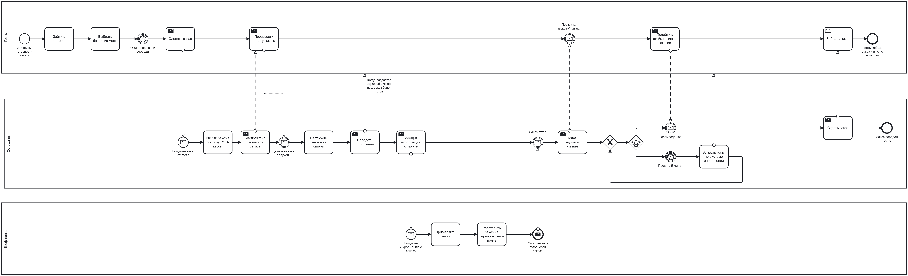

## 7. Pizza order - calm down the customer

### Задание:

Смоделируйте следующий процесс:

Если клиент звонит из-за задержки доставки пиццы, продавец должен его успокоить.

**Подсказки**:
- Для решения достаточно, если пул клиентов свернут
- Вам не нужно создавать новую модель.  Достаточно изменить существующую.
- Каждая подзадача (набор символов 1 или набор символов 2) должна быть разработана в рамках отдельной модели BPMN.

**Наборы символов, которые нужно использовать**:
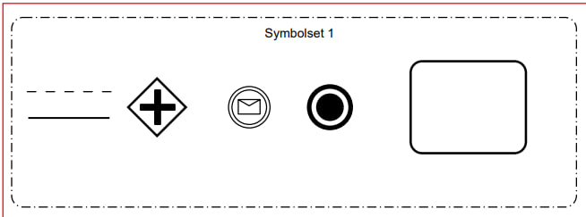

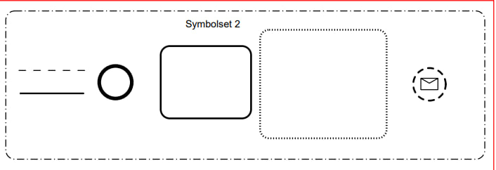

**Исходная BPMN-схема**:
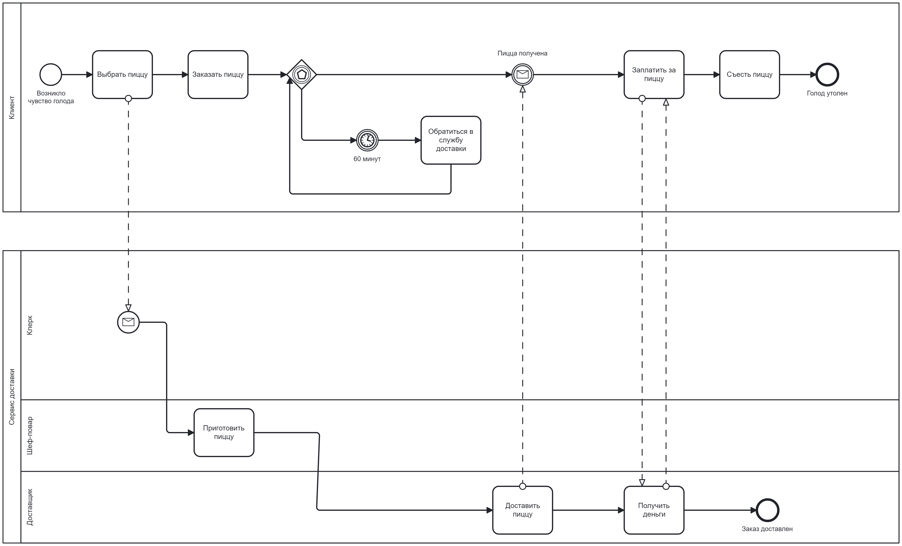

**BPMN-схема с набором символов 1**:
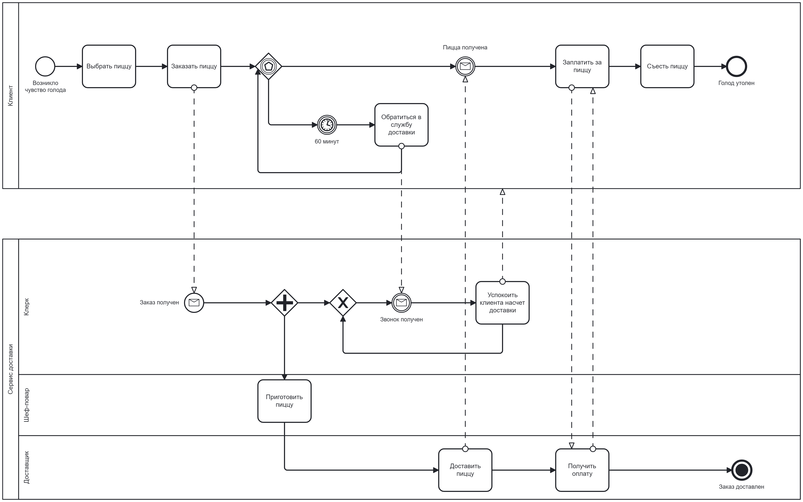
**BPMN-схема с набором символов 2**:
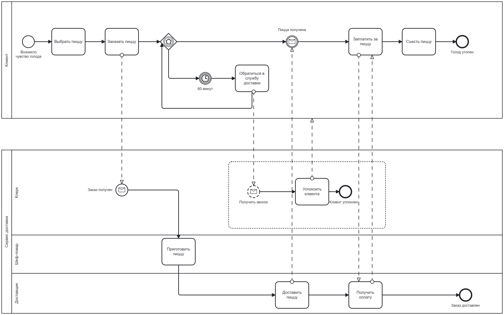

## 8. Pizza order - interrupting the inquiry

### Задание:

Смоделируйте следующий процесс:

Если клиент получает пиццу во время звонка, он завершает телефонный разговор и
оплачивает пиццу.

**BPMN-схема**:
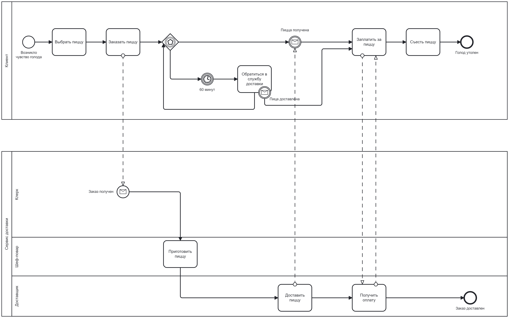

## 9. Handling problems

### Задание:

Добавьте решение следующих проблем к той же модели, которая показывает оптимальный путь:
1. Данные о заказе неполные
2. Данные о заказе нечитаемы
3. Номер клиента в заказе указан неверно
4. Кредитный рейтинг клиента недостаточен
5. Заказанный товар недоступен
6. Не удалось отправить подтверждение заказа

**Подсказки**:
- Для каждой задачи используйте либо событие ошибки, связанное с заданием, либо XOR-шлюз после выполнения задания
- За исключением задачи 6, все вышеперечисленные ситуации приводят к отклонению заказа!
- Используйте одну и ту же модель для всего задания.
- Вам не нужно моделировать события, вызывающие ошибки. Предположим, что ошибки были созданы в рамках действий. Вам нужно только моделировать обработчики ошибок там, где это применимо.

**BPMN-схема**:
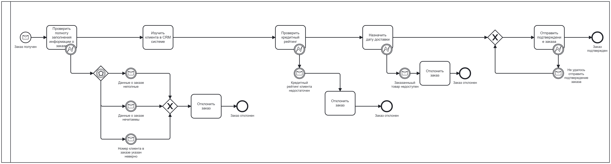

## 10. Invoice receipt

### Описание:
Это описание процесса объясняет, как компания работает с поступающими счетами-фактурами. Они оценивают, можно ли автоматизировать эту процедуру для будущих счетов-фактур.

## 10.1 Strategic model

### Задание:

Смоделируйте следующий процесс:

Счета-фактуры отправляются в компанию по почте. Ассистент команды получает счет-фактуру и сканирует его. Затем утверждающий получает счет-фактуру и проверяет его. Утверждающий решает, утвержден счет-фактура или нет. Если счет-фактура утверждается, менеджер оплачивает счет-фактуру. Если счет-фактура отклоняется, ассистент команды уточняет ситуацию у стороны, выставляющей счет. Если
уточнение прошло успешно, утверждающий получает исправленный счет-фактуру и проверяет его. Если уточнение не увенчалось успехом, ассистент команды отменяет обработку счета-фактуры.

**BPMN-схема**:
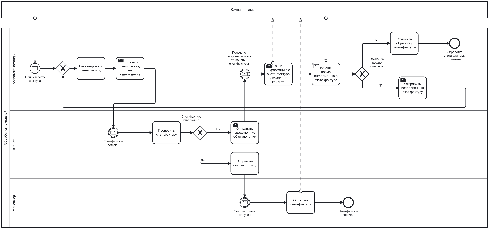

## 10.2 Operational model (human process flow)

**Описание процесса**:

Стратегическая модель была обсуждена с руководством и вовлеченными сотрудниками. Теперь процесс необходимо задокументировать более подробно. Таким образом, было собрано больше информации о процессе. 

Следующая информация получена в результате семинара по выявлению процессов:

**Ассистент команды**: 
Существующая модель довольно хорошо показывает процесс, хотя некоторые этапы
отсутствуют. Первое, что я замечаю, - это обработка счета-фактуры. Кстати, я получаю счет-фактуру из нашего почтового отделения. Перед сканированием счета-фактуры я должен проверить его достоверность с точки зрения содержания. Счет-фактура может быть оформлен неправильно. Мне разрешено сканировать только достоверные счета-фактуры. В случае ложных счетов-фактур мне необходимо получить новый от лица, выставляющего счет. В этом случае я останавливаю процесс на этом этапе. Отправляю зявку на получение нового счета-фактуры. 
После сканирования счета-фактуры я передаю его утверждающему лицу. Если все в порядке, мне больше ничего не нужно делать. Если счет-фактура не утвержден, мне нужно уточнить это у стороны, выставляющей счет. На данный момент модель верна: если я не смог прояснить ситуацию, я останавливаю процесс. В противном случае я снова передаю обновленный счет утверждающему лицу”. 

**Юрист**: 
Мне нечего добавить. Модель хорошо описывает мои действия.

**Менеджер**: 
Модель хорошо отражает процесс, я согласен с предыдущими докладчиками.  Упомянутые действия должны быть отражены в модели. Это важно. Я не хочу оплачивать неправильные счета. Каждый должен это знать и осознавать. Это означает, что я хочу получать только утвержденные и исправленные счета-фактуры. Я не хочу видеть никаких неправильных счетов-фактур. Если я получаю только правильные
счета-фактуры, я знаю, что смогу оплатить их напрямую. После оплаты, с моей точки зрения, счет-фактура обрабатывается полностью. 
Однако отсутствует один важный шаг: необходимо предоставить печатную копию счета-фактуры на бумажном носителе. Она хранится в архиве. Цифровая версия счета-фактуры (PDF-файл) должна быть заархивирована в нашей  Системе управления (DMS) в будущем. Этот шаг должен быть автоматизирован. Предполагается, что печатная копия счета-фактуры будет заархивирована помощником команды сразу после ее сканирования. 

Менеджер добавляет еще кое-что: Описанный процесс верен. Тем не менее, вам следует
учитывать, что я оплачиваю открытые счета “одним махом”. Я делаю это, когда у меня есть немного свободного времени. Я не
хочу обрабатывать каждый счет-фактуру. Это заняло бы слишком много времени.”

### Задание:
 - Смоделируйте модель операционного процесса, включая человеческие процессы.
- Интерфейсы между процессами (взаимодействие между участниками) должны быть смоделированы в явном виде, поскольку ваша модель обеспечит основу для автоматизации

**BPMN-схема**:

