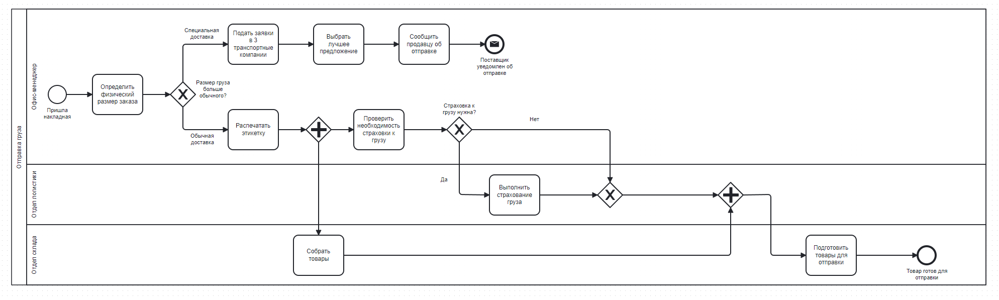

# BPMN Tasks

## 1. Dispatch of goods

### Задание: 

Компания, производящая компьютерное оборудование, хотела бы смоделировать процесс доставки, чтобы сделать его видимым и
понятным для всех сотрудников фирмы. 

Вот описание процесса, данное офис-менеджером:
При отправке заказов я сначала определяю физический размер заказа. Если я определяю, что размер посылки больше, чем у обычной почтовой коробки (она же "специальная доставка"), я связываюсь с тремя транспортными компаниями и запрашиваю у каждой из них цену. Затем я выбираю лучшее предложение и сообщаю продавцу о предстоящей
отправке.
С другой стороны, если я решаю, что для заказа можно использовать обычную упаковочную коробку, я распечатываю этикетку и проверяю, нужна ли страховка. Если страховка необходима, сотрудники отдела логистики позаботятся
о страховании отправления.

Пока это происходит, сотрудники склада собирают и упаковывают необходимые товары.
Как только способ отгрузки определен и настроен, сотрудники склада подготавливают
товары для отправки выбранному поставщику.

**Подсказки**:
- Задача процесса заключается только в подготовке к отправке, а не в самой отправке.
- Этот процесс должен быть для внутренней организации. Транспортные компании в нем не участвуют

**BPMN-схема**:

