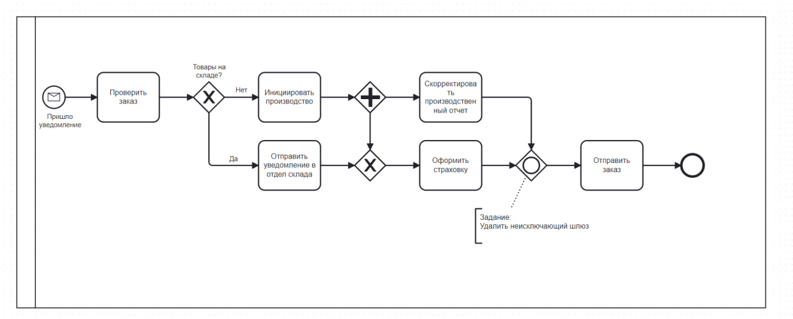

# BPMN Tasks

## 1. Dispatch of goods

### Задание: 

Компания, производящая компьютерное оборудование, хотела бы смоделировать процесс доставки, чтобы сделать его видимым и
понятным для всех сотрудников фирмы. 

Вот описание процесса, данное офис-менеджером:
При отправке заказов я сначала определяю физический размер заказа. Если я определяю, что размер посылки больше, чем у обычной почтовой коробки (она же "специальная доставка"), я связываюсь с тремя транспортными компаниями и запрашиваю у каждой из них цену. Затем я выбираю лучшее предложение и сообщаю продавцу о предстоящей
отправке.
С другой стороны, если я решаю, что для заказа можно использовать обычную упаковочную коробку, я распечатываю этикетку и проверяю, нужна ли страховка. Если страховка необходима, сотрудники отдела логистики позаботятся
о страховании отправления.

Пока это происходит, сотрудники склада собирают и упаковывают необходимые товары.
Как только способ отгрузки определен и настроен, сотрудники склада подготавливают
товары для отправки выбранному поставщику.

**Подсказки**:
- Задача процесса заключается только в подготовке к отправке, а не в самой отправке.
- Этот процесс должен быть для внутренней организации. Транспортные компании в нем не участвуют

**BPMN-схема**:

## 2. Eliminate the OR join

### Задание:

Удалить неисключающий шлюз

**Исходная BPMN-схема**:

**Исправленная BPMN-схема**:

## Recourse

### Задание: 

Держатели страховых полисов могут быть вынуждены вернуть деньги, которые они получили от страховой компании по разным причинам. 

Эта процедура называется "обращение в суд", юрист страховой компании описывает, как работает этот процесс:

Я получил сообщение о возможном обращении в суд. Я изучу это и, если решу, что обращение
в суд невозможно, просто закрою дело. 
Если я решу, что обращение в суд действительно возможно, я отправлю запрос на возврат средств, а затем назначу дату платежа.

Далее произойдет одно из трех событий. 
* Если мы получим деньги, я обработаю платеж и закрою дело. 
* Если по истечении срока платеж не будет получен, я передам дело в коллекторское агентство. 
* Если я получу ответ от страхователя, обжалующего выплату, я изучу причину обжалования. Если я приду к выводу, что страхователь был прав, я закрою дело. В противном случае я передам дело в коллекторское агентство.

**BPMN-схема**:

